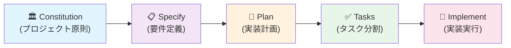

# Spec-Driven RAG PoC

## 概要

- 仕様駆動開発（Specification-Driven Development）と GitHub Copilot を活用した RAG（Retrieval-Augmented Generation）を活用したAIチャットボットの PoC プロジェクト。
- 仕様駆動開発とRAGを学ぶにあたりRAGを活用したAIチャットボットの構築をPoCで行います。
- RAGにはベクターDBのChromaDBを使います。単純にノウハウをテキストデータでAIにInputするのとベクターDBを利用する場合との違いを明確化します。

## 特徴

- **仕様駆動**: 曖昧さを排除し、AI による無駄なアウトプットを削減
- **GitHub Spec Kit**: 仕様から実装までの段階的な流れをサポート
- **GitHub Copilot 統合**: スラッシュコマンドによる構造化ワークフロー
- **DevContainer**: Windows + Docker + WSL2 でチーム全体が同じ環境を共有

## 環境構成

```text
Windows 11
└─ VS Code + Dev Containers 拡張機能
    └─ WSL2 (Debian)
        └─ Docker
            └─ DevContainer
                ├─ Python 3.11+
                ├─ uv（パッケージマネージャー）
                ├─ GitHub Spec Kit (specify-cli)
                ├─ GitHub Copilot
                └─ Development Tools
                      ├─ git
                      └─ Node.js 24

VS Code 拡張機能（ホスト側 Windows）
├─ Dev Containers（ms-vscode-remote.remote-containers）

VS Code 拡張機能（DevContainer 内で自動インストール）
├─ GitHub Copilot（GitHub.copilot）
├─ GitHub Copilot Chat（GitHub.copilot-chat）
├─ Python（ms-python.python）
├─ Pylance（ms-python.vscode-pylance）
├─ Makefile Tools（ms-vscode.makefile-tools）
└─ Ruff（charliermarsh.ruff）
```

## 環境構築

### Step 1: VS Code と拡張機能のインストール
- Windows 11 に VS Code をインストール
- 以下の拡張機能をインストール：
  - **Dev Containers**（ms-vscode-remote.remote-containers）

### Step 2: WSL2（Debian）のインストール
- PowerShell（管理者権限）で以下のコマンドを実行
  ```powershell
  iwr -Uri "https://raw.githubusercontent.com/swdevsmz/spec_diven_rag_poc/main/wsl_setup_scripts/wsl_debian_install.ps1" -UseBasicParsing | iex
  ```
- スクリプトが Debian をインストールし、初回起動時にユーザー名とパスワードの設定を求めます。

### Step 3: リポジトリのクローン（WSL 内）
- WSL（Debian）内でこのリポジトリをクローン
  ```bash
  cd ~
  git clone https://github.com/swdevsmz/spec_diven_rag_poc.git
  cd spec_diven_rag_poc
  ```

### Step 4: Docker のインストール（WSL 内）
- WSL（Debian）内で `wsl_docker_install.sh` を実行
  ```bash
  bash wsl_setup_scripts/wsl_docker_install.sh
  ```
- スクリプト完了後、一度 WSL から `exit` で抜けて、PowerShell で `wsl --shutdown` を実行してください。

### Step 5: DevContainer の起動
- VS Code で WSL 内のリポジトリを開く
  - VS Code のコマンドパレット（Ctrl+Shift+P）から **WSL: Connect to WSL** を選択
  - WSL 接続後、`~/spec_diven_rag_poc` フォルダを開く
- コマンドパレット（Ctrl+Shift+P）から **Dev Containers: Reopen in Container** を選択
- DevContainer が起動し、`.devcontainer/post-create.sh` が自動実行されます。
- 起動確認
  - DevContainer 内で以下を実行してセットアップを確認：
    ```bash
    specify check
    ```

## 仕様駆動開発のワークフロー

GitHub Spec Kit を使用した仕様駆動開発（Spec-Driven Development）のワークフローを以下に示します。このフローは公式の 5つのフェーズに基づき、プロジェクト独自の GitHub Issue/PR 連携を組み合わせたものです。

### Specify プロジェクト初期

プロジェクト初期化と環境確認：

```bash
# プロジェクトの初期化（AI アシスタントの選択を含む）
# --here オプションで現在のディレクトリに直接作成
specify init --here --ai copilot

# インストール済みのツール確認
specify check
```

※ 各コマンド実行時に生成・更新される主なファイル／ディレクトリ（2026年2月14日実行、CLI v0.1.0、Template v0.0.95）:

- **specify init --here --ai copilot**
  - `--here` オプションを使用すると、現在のディレクトリ（リポジトリルート）に直接以下のファイル／ディレクトリを生成します（合計31ファイル、9ディレクトリ）。
  - `<PROJECT_NAME>` を指定した場合は、サブディレクトリが作成されます。
  
  ```
  /workspaces/spec_diven_rag_poc/  # リポジトリルート
  ├── .github/
  │   ├── agents/                          # GitHub Copilot Agent 定義ファイル（9個）
  │   │   ├── speckit.analyze.agent.md
  │   │   ├── speckit.checklist.agent.md
  │   │   ├── speckit.clarify.agent.md
  │   │   ├── speckit.constitution.agent.md
  │   │   ├── speckit.implement.agent.md
  │   │   ├── speckit.plan.agent.md
  │   │   ├── speckit.specify.agent.md
  │   │   ├── speckit.tasks.agent.md
  │   │   └── speckit.taskstoissues.agent.md
  │   └── prompts/                         # Agent 用プロンプトテンプレート（9個）
  │       ├── speckit.analyze.prompt.md
  │       ├── speckit.checklist.prompt.md
  │       ├── speckit.clarify.prompt.md
  │       ├── speckit.constitution.prompt.md
  │       ├── speckit.implement.prompt.md
  │       ├── speckit.plan.prompt.md
  │       ├── speckit.specify.prompt.md
  │       ├── speckit.tasks.prompt.md
  │       └── speckit.taskstoissues.prompt.md
  ├── .specify/
  │   ├── memory/
  │   │   └── constitution.md              # プロジェクト原則の雛形
  │   ├── scripts/
  │   │   └── bash/                        # 補助スクリプト（5個）
  │   │       ├── check-prerequisites.sh
  │   │       ├── common.sh
  │   │       ├── create-new-feature.sh
  │   │       ├── setup-plan.sh
  │   │       └── update-agent-context.sh
  │   └── templates/                       # 各種ドキュメントテンプレート（6個）
  │       ├── agent-file-template.md
  │       ├── checklist-template.md
  │       ├── constitution-template.md
  │       ├── plan-template.md
  │       ├── spec-template.md
  │       └── tasks-template.md
  └── .vscode/
      └── settings.json                    # VSCode エディタ設定
  ```

  - **目的**: GitHub Copilot と連携した `/speckit.*` スラッシュコマンド（constitution、specify、plan、tasks、implement 等）を利用可能にし、仕様駆動開発のワークフローを実現します。
  - **注意**: 既存の Git リポジトリがある場合は `.git/` の新規作成はスキップされます。

- **specify check**
  - 環境や依存ツールの診断を実行し、標準出力で結果を返します。ファイルは作成されません。

- **specify version**
  - Specify CLI とテンプレートのバージョン情報を表示します。ファイルは作成されません。

（注）テンプレートの内容やファイル名は Specify のバージョンや選択した AI アシスタント、スクリプト種別により変わる可能性があります。`--here` オプションを使用した場合は `.github/` および `.specify/` 配下を、`<PROJECT_NAME>` を指定した場合は `<PROJECT_NAME>/` 配下を直接確認してください。


### GitHub Spec Kit の 5つの開発フェーズ

Spec Kit では、以下の 5つのフェーズを順序に実行して開発を進めます：

#### フェーズ概要（フロー図）



#### フェーズ詳細テーブル

| フェーズ | 説明 | コマンド | 主な成果物 |
|---------|------|---------|-----------|
| 🏛️ Constitution | プロジェクト開発規約・方針を確立 | `/speckit.constitution` | `.specify/memory/constitution.md` |
| 📋 Specify | 実装する機能の要件（WHAT）を定義 | `/speckit.specify` | `.specify/features/[name]/spec.md` |
| 📐 Plan | 技術スタックと設計（HOW）を定義 | `/speckit.plan` | `.specify/features/[name]/plan.md` |
| ✅ Tasks | 実装計画をアクション可能なタスクに分割 | `/speckit.tasks` | `.specify/features/[name]/tasks.md` |
| 🔨 Implement | 分割されたタスクに基づいて実装を実行 | `/speckit.implement` | ソースコード、テスト、PR |

#### 1. Constitution（憲法・プロジェクト原則）
プロジェクトの開発規約と方針を確立します。選択した AI アシスタント内で `/speckit.constitution` コマンドを実行してください。

例：
```
/speckit.constitution
- 目的: 仕様駆動でRAGを使ったチャットボットの構築を行い、仕様駆動の理解とRAGの理解をすすめ、RAGに関しては非RAGの差分を教育的に検証する。
- 最優先: 再現性と可視化（何をしたか／なぜ行ったかを後から説明できること）。
- 評価: RAGとNon-RAGの比較を定量・定性で必ず行う。仕様駆動の理解・ドキュメントの網羅性を検証する。
- セキュリティ: シークレットはプロジェクト内に埋め込まない（環境変数で管理）。
- スコープ: 教育・検証を優先し、MVPで素早く回す。
- 制約：作成するドキュメントは日本語にすること
```

#### 2. Specify（要件定義）
実装したい機能の要件（WHAT）を定義します。選択した AI アシスタント内で `/speckit.specify` コマンドを実行してください。

例：
```
/speckit.specify RAGチャットボット（rag-chat）: ユーザーが日本語ドキュメント群をもとに質問できるチャットを実装する。ワークフロー: (1) ドキュメント取り込みと前処理、(2) 埋め込み生成（使用モデルと次元数を明記）、(3) ChromaDB へ格納、(4) 質問時に上位 N 件を検索して生成モデルに渡し応答を生成する。必須機能: ベクトル化スクリプト、検索 API、生成パイプライン、実験ログ（入力・取得ドキュメントID・モデル名・パラメータを含む）、Non‑RAG 比較モード。評価指標: 正答率、ファクト一致率、ユーザビリティ評価（サンプル10問）。再現性: `experiments/` に再現手順とメタデータを保存。制約: シークレットは環境変数で管理、主要ドキュメントは日本語で記載、MVP優先でスケーリングは除外。
```

#### 3. Plan（実装計画）
技術的な実装方法（HOW）と設計を定義します。`/speckit.plan` コマンドを実行してください。

例：
```
/speckit.plan バックエンド: FastAPI + ChromaDB。フロント: React。質問入力フォーム、ベクトル検索、AI 応答生成の 3ステップで実装。
```

#### 4. Tasks（タスク分割）
実装計画をアクション可能なタスクに分割します。`/speckit.tasks` コマンドを実行してください。

#### 5. Implement（実装実行）
分割されたタスクに基づき、実装を実行します。`/speckit.implement` コマンドを実行してください。

### プロジェクト独自：GitHub Issue/PR との連携（実装後に詳述）

Spec Kit の公式フローに加えて、このプロジェクトでは以下の運用を推奨します（詳細は実装進行に伴い更新予定）：

- **仕様の永続化**: `/specify` フェーズで生成された仕様を `specs/` フォルダに Markdown ファイルとして保存
- **Issue トラッキング**: GitHub Issue で仕様にリンクし、進捗を追跡
- **PR チェック**: `.github/PULL_REQUEST_TEMPLATE.md` を使用して、仕様へのリンクを必須化

詳細な手順と例は実装進行に伴い充実させます。