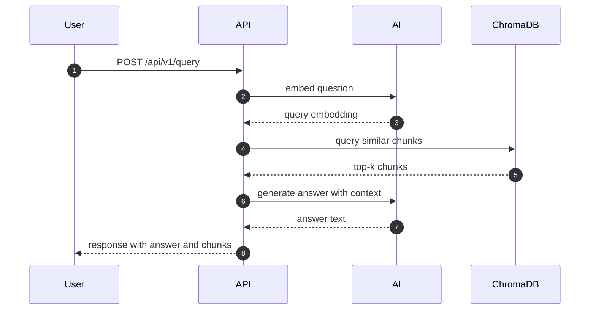

# Backend

## セットアップ

```bash
cd application/backend
sudo env "PATH=$PATH" uv pip install --system --break-system-packages -r requirements.txt
```

## 環境変数

`application/backend/.env` に以下を設定します。

```bash
GEMINI_API_KEY=your_gemini_api_key
CHROMA_HOST=localhost
CHROMA_PORT=8001
CHROMA_PERSIST_DIRECTORY=data/chromadb
GENERATION_MODEL=gemini-2.5-flash
EMBEDDING_MODEL=gemini-embedding-001
LOG_LEVEL=INFO
```

`CHROMA_PERSIST_DIRECTORY` に指定したディレクトリへ、ChromaDB のデータがローカル永続保存されます（Docker不要）。

## 起動

```bash
uv run --with-requirements requirements.txt uvicorn app.main:app --reload --host 0.0.0.0 --port 8000
```

## テストデータ投入スクリプト

リポジトリルートで実行します。

```bash
uv run --with-requirements application/backend/requirements.txt python application/backend/data_setup/prepare_test_data.py
```

## Python・AI・ChromaDB の役割

- Python（FastAPI）: API の受付、処理フロー制御、データ整形を担当
- AI（Gemini）: 埋め込み生成と最終回答生成を担当
- ChromaDB: ドキュメントのベクトル保存と類似検索を担当

### 質問応答のシーケンス図




## コードの読み方（主要処理フロー）

このプロジェクトは、`API層 → Service層 → VectorDB/外部API` の順で追うと理解しやすい構成です。

### 1. アプリ起動の流れ

1. `app/main.py` で FastAPI アプリ生成
2. 起動時に `GEMINI_API_KEY` を検証
3. `queries` / `documents` ルーターを登録

### 2. 質問応答（RAG）の流れ

入口: `POST /api/v1/query`（`app/api/queries.py`）

1. 質問文を埋め込み化（`services/embedding.py`）
2. ChromaDB で類似チャンク検索（`services/vectordb.py`）
3. 取得チャンクからRAGプロンプトを構築（`services/generation.py`）
4. Gemini `generateContent` で回答生成（`services/generation.py`）
5. `QueryResponse` 形式で返却（`models/query.py`）

### 3. ドキュメント登録・ベクトル化の流れ

入口:
- `POST /api/v1/documents`
- `POST /api/v1/documents/{document_id}/vectorize`

処理（`app/api/documents.py`）:

1. アップロードファイルを `data/documents/` に保存
2. `documents_index.json` にメタ情報を記録
3. テキスト抽出・分割（`utils/file_handlers.py`）
4. 各チャンクを埋め込み化（`services/embedding.py`）
5. ChromaDB に保存（`services/vectordb.py`）
6. ステータスを `pending -> processed` に更新

### 4. まず読むべきファイル順（おすすめ）

1. `app/main.py`（全体の入口）
2. `app/api/queries.py`（質問応答の業務フロー）
3. `app/api/documents.py`（登録・前処理フロー）
4. `app/services/embedding.py` / `app/services/generation.py`（外部AI連携）
5. `app/services/vectordb.py`（検索・保存ロジック）
6. `app/models/*.py`（入出力スキーマ）
