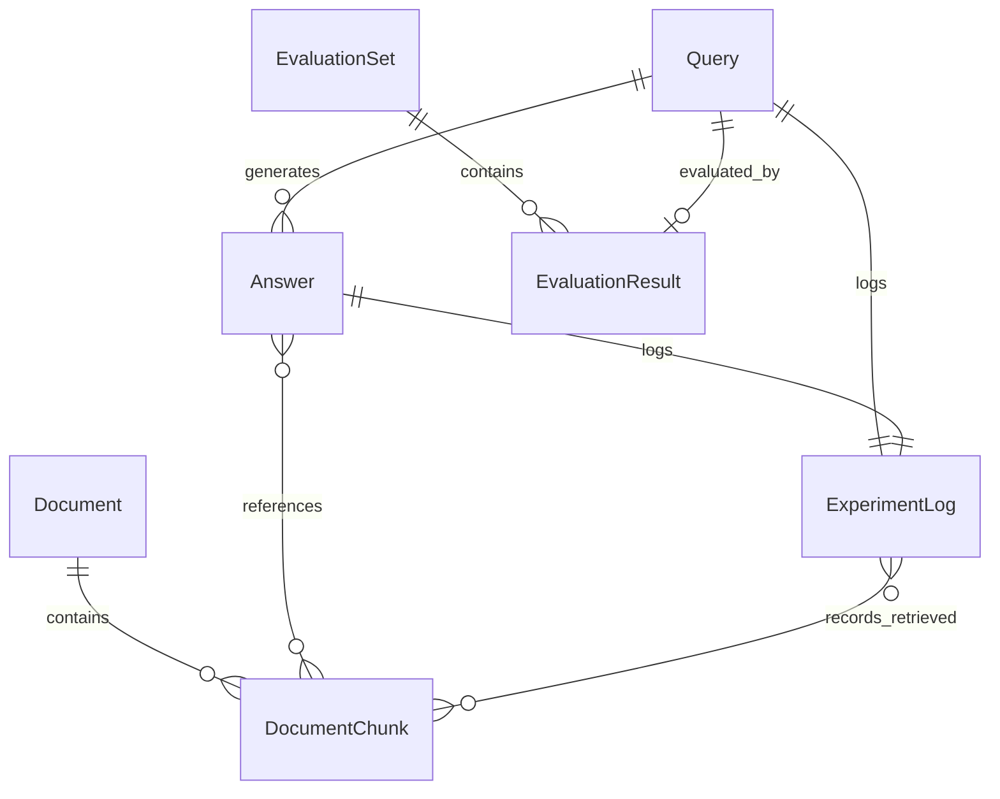

# Data Model: RAGチャットボット

**Date**: 2026-02-14  
**Purpose**: システムのコアエンティティとそのリレーションシップを定義

## Entity Relationships



---

## 1. Document (ドキュメント)

### Description
システムに登録される日本語の情報源。RAG の知識ベースとなる。

### Fields

| フィールド名 | 型 | 必須 | 説明 |
|------------|-----|------|------|
| `document_id` | UUID | ✅ | ドキュメントの一意識別子 |
| `filename` | String | ✅ | 元のファイル名 (例: "manual.pdf") |
| `content` | Text | ✅ | ドキュメントの全文テキスト (日本語) |
| `metadata` | JSON | ❌ | 追加情報 (著者、作成日、カテゴリ等) |
| `created_at` | DateTime | ✅ | システムへの登録日時 |
| `file_type` | String | ✅ | ファイル形式 (txt, pdf, md) |
| `status` | Enum | ✅ | 処理状態 (pending, processed, error) |

### Validation Rules
- `content` は空文字列不可
- `file_type` は ['txt', 'pdf', 'md'] のいずれか
- `status` は ['pending', 'processed', 'error'] のいずれか

### Relationships
- 1つの Document は複数の DocumentChunk を持つ (1:N)

### State Transitions
```
pending → processed (ベクトル化成功)
pending → error (ベクトル化失敗)
```

---

## 2. DocumentChunk (ドキュメントチャンク)

### Description
ドキュメントを分割した検索可能な単位。ベクトル検索の基本単位。

### Fields

| フィールド名 | 型 | 必須 | 説明 |
|------------|-----|------|------|
| `chunk_id` | UUID | ✅ | チャンクの一意識別子 |
| `document_id` | UUID (FK) | ✅ | 親ドキュメントの ID |
| `chunk_index` | Integer | ✅ | ドキュメント内での順序 (0-indexed) |
| `content` | Text | ✅ | チャンクのテキスト内容 (日本語) |
| `embedding` | Vector[1536] | ✅ | 埋め込みベクトル (text-embedding-3-small) |
| `metadata` | JSON | ❌ | チャンク固有のメタデータ (ページ番号等) |
| `created_at` | DateTime | ✅ | 作成日時 |

### Validation Rules
- `content` の長さは 10 文字以上 (意味のあるチャンク)
- `embedding` の次元数は 1536 (OpenAI text-embedding-3-small)
- `chunk_index` は非負整数

### Relationships
- 1つの DocumentChunk は 1つの Document に属する (N:1)
- 1つの DocumentChunk は複数の Answer から参照される可能性がある (N:M)
- 1つの DocumentChunk は複数の ExperimentLog に記録される可能性がある (N:M)

### Storage
- ChromaDB に格納 (embedding + content + metadata)
- Collection名: `rag_documents`

---

## 3. Query (質問)

### Description
ユーザーが入力する日本語のクエリ。

### Fields

| フィールド名 | 型 | 必須 | 説明 |
|------------|-----|------|------|
| `query_id` | UUID | ✅ | 質問の一意識別子 |
| `text` | Text | ✅ | 質問文 (日本語) |
| `embedding` | Vector[1536] | ✅ | 質問の埋め込みベクトル |
| `user_id` | String | ❌ | ユーザー識別子 (将来拡張用) |
| `created_at` | DateTime | ✅ | 質問日時 |
| `mode` | Enum | ✅ | RAG or Non-RAG |

### Validation Rules
- `text` は空文字列不可、10文字以上推奨
- `mode` は ['rag', 'non_rag'] のいずれか
- 質問文は日本語であることを推奨 (バリデーションは緩く)

### Relationships
- 1つの Query は 1つ以上の Answer を生成する (1:N)
- 1つの Query は 1つの ExperimentLog を持つ (1:1)

---

## 4. Answer (回答)

### Description
システムが生成する応答。

### Fields

| フィールド名 | 型 | 必須 | 説明 |
|------------|-----|------|------|
| `answer_id` | UUID | ✅ | 回答の一意識別子 |
| `query_id` | UUID (FK) | ✅ | 対応する質問の ID |
| `text` | Text | ✅ | 回答文 (日本語) |
| `referenced_chunk_ids` | List[UUID] | ✅ | 参照したチャンクの ID リスト (RAG mode) |
| `model_name` | String | ✅ | 使用した生成モデル (例: "gpt-4o-mini") |
| `temperature` | Float | ✅ | 生成時の temperature パラメータ |
| `max_tokens` | Integer | ✅ | 最大トークン数 |
| `created_at` | DateTime | ✅ | 回答生成日時 |
| `response_time_ms` | Integer | ✅ | 回答生成にかかった時間 (ミリ秒) |

### Validation Rules
- `text` は空文字列不可
- `referenced_chunk_ids` は RAG モードの場合は必須、Non-RAG モードの場合は空リスト
- `temperature` は 0.0 ~ 2.0
- `response_time_ms` は非負整数

### Relationships
- 1つの Answer は 1つの Query に対応する (N:1)
- 1つの Answer は複数の DocumentChunk を参照する可能性がある (N:M)
- 1つの Answer は 1つの ExperimentLog に記録される (1:1)

---

## 5. ExperimentLog (実験記録)

### Description
質問応答セッションの詳細情報。再現性のために記録。

### Fields

| フィールド名 | 型 | 必須 | 説明 |
|------------|-----|------|------|
| `log_id` | UUID | ✅ | ログの一意識別子 |
| `query_id` | UUID (FK) | ✅ | 質問 ID |
| `answer_id` | UUID (FK) | ✅ | 回答 ID |
| `mode` | Enum | ✅ | RAG or Non-RAG |
| `retrieved_chunk_ids` | List[UUID] | ✅ | 検索で取得したチャンク ID (RAG mode) |
| `retrieval_scores` | List[Float] | ✅ | 各チャンクの類似度スコア |
| `model_parameters` | JSON | ✅ | 全生成パラメータ (temperature, max_tokens 等) |
| `embedding_model` | String | ✅ | 使用した埋め込みモデル |
| `generation_model` | String | ✅ | 使用した生成モデル |
| `created_at` | DateTime | ✅ | ログ記録日時 |
| `metadata` | JSON | ❌ | 追加情報 (実験名、バージョン等) |

### Validation Rules
- `mode` は ['rag', 'non_rag'] のいずれか
- `retrieved_chunk_ids` と `retrieval_scores` の長さは一致
- RAG モードの場合、`retrieved_chunk_ids` は非空リスト

### Relationships
- 1つの ExperimentLog は 1つの Query に対応する (1:1)
- 1つの ExperimentLog は 1つの Answer に対応する (1:1)
- 1つの ExperimentLog は複数の DocumentChunk を記録する (N:M)

### Storage
- ファイルシステムに JSON Lines 形式で保存
- Path: `experiments/logs/{date}/{log_id}.json`

---

## 6. EvaluationSet (評価用質問セット)

### Description
システム評価のための質問セット。

### Fields

| フィールド名 | 型 | 必須 | 説明 |
|------------|-----|------|------|
| `set_id` | UUID | ✅ | セットの一意識別子 |
| `name` | String | ✅ | セット名 (例: "MVP評価10問") |
| `description` | Text | ❌ | セットの説明 |
| `questions` | List[UUID] | ✅ | 質問 ID のリスト |
| `created_at` | DateTime | ✅ | 作成日時 |

### Validation Rules
- `questions` リストは 1 問以上
- `name` は空文字列不可

### Relationships
- 1つの EvaluationSet は複数の EvaluationResult を持つ (1:N)

### Storage
- ファイルシステムに JSON 形式で保存
- Path: `data/evaluation_sets/{set_id}.json`

---

## 7. EvaluationResult (評価結果)

### Description
評価用質問に対する実行結果と評価スコア。

### Fields

| フィールド名 | 型 | 必須 | 説明 |
|------------|-----|------|------|
| `result_id` | UUID | ✅ | 評価結果の一意識別子 |
| `set_id` | UUID (FK) | ✅ | 評価セット ID |
| `query_id` | UUID (FK) | ✅ | 質問 ID |
| `answer_id` | UUID (FK) | ✅ | 回答 ID |
| `is_correct` | Boolean | ✅ | 正答判定 |
| `fact_match_score` | Float | ✅ | ファクト一致率 (0.0 ~ 1.0) |
| `usability_score` | Integer | ❌ | ユーザビリティスコア (1-5) |
| `evaluator` | String | ✅ | 評価者 (human, auto) |
| `evaluated_at` | DateTime | ✅ | 評価日時 |
| `notes` | Text | ❌ | 評価コメント |

### Validation Rules
- `fact_match_score` は 0.0 ~ 1.0
- `usability_score` は 1 ~ 5 (nullable)
- `evaluator` は ['human', 'auto'] のいずれか

### Relationships
- 1つの EvaluationResult は 1つの EvaluationSet に属する (N:1)
- 1つの EvaluationResult は 1つの Query に対応する (N:1)

### Aggregation
セット全体の集計指標：
- 正答率: `sum(is_correct) / count(*)`
- 平均ファクト一致率: `avg(fact_match_score)`
- 平均ユーザビリティ: `avg(usability_score)`

---

## Storage Strategy

### ChromaDB (ベクトルストア)
- **Collection**: `rag_documents`
- **Documents**: DocumentChunk の content
- **Embeddings**: DocumentChunk の embedding
- **Metadata**: `{"document_id": "...", "chunk_index": 0, "document_filename": "..."}`
- **IDs**: chunk_id (UUID as string)

### File System (ログ・データ)
```
experiments/
├── logs/
│   └── {YYYY-MM-DD}/
│       └── {log_id}.json
└── README.md

data/
├── documents/
│   └── {document_id}.txt/pdf/md
└── evaluation_sets/
    └── {set_id}.json
```

### Backend Database (オプション・将来拡張)
MVP では不要。すべてのメタデータは ChromaDB の metadata と JSON ファイルで管理。

---

## Summary

すべてのエンティティが仕様の Key Entities と一致し、リレーションシップが明確化されました。Phase 1 の次のステップ (API Contracts) でこれらのエンティティを操作する API を定義します。
