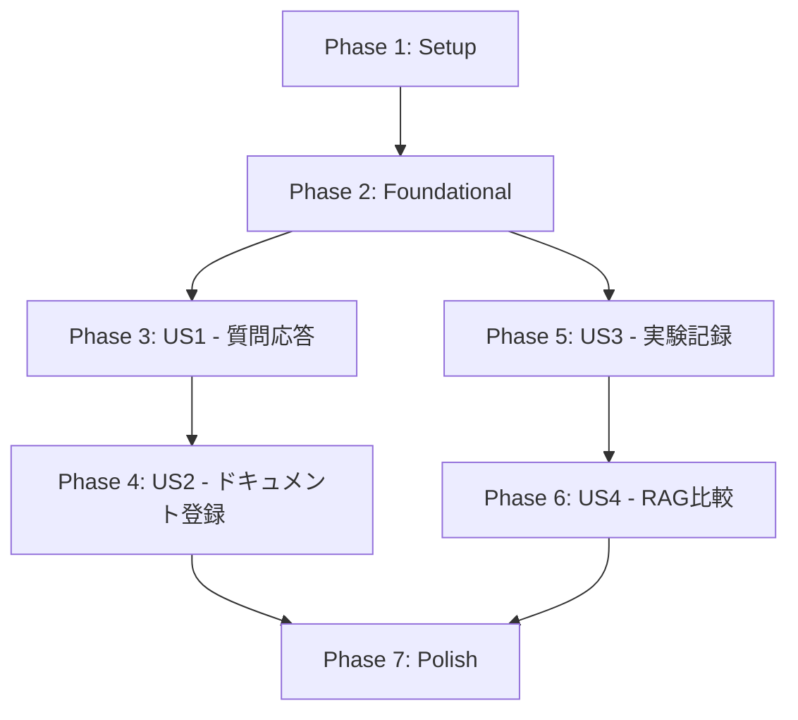

# Implementation Tasks: RAGチャットボット

**Feature Branch**: `001-rag-chat`  
**Spec**: [spec.md](./spec.md)  
**Plan**: [plan.md](./plan.md)  
**Date**: 2026-02-15

---

## Overview

このタスクリストは、RAGチャットボットの実装を **ユーザーストーリー単位** で段階的に進めるための実行計画です。各フェーズは独立してテスト可能な完結したインクリメントとして設計されています。

### MVP Strategy

**MVP = User Story 1 のみ**
- P1（質問応答）を最初に完全実装
- 最小限の価値提供で動作検証
- 以降のストーリーは段階的に追加

### User Story Priorities

| Priority | User Story | Description | MVP |
|----------|-----------|-------------|-----|
| P1 | US1 | 日本語ドキュメントに基づく質問応答 | ✅ |
| P2 | US2 | ドキュメントの登録と前処理 | ❌ |
| P3 | US3 | 実験記録と評価 | ❌ |
| P4 | US4 | RAG vs Non-RAG 比較評価 | ❌ |

---

## Task Format Legend

```
- [ ] [TaskID] [P?] [Story?] Description with file path
```

- **TaskID**: T001, T002... (実行順序)
- **[P]**: 並列実行可能（別ファイル、依存なし）
- **[Story]**: [US1], [US2], [US3], [US4] - 対応するユーザーストーリー
- **File path**: 実装対象の具体的なファイルパス

---

## Dependencies & Execution Order

### Story Dependency Graph



### Phase Completion Criteria

- **Phase 1 完了**: プロジェクト構造とDocker環境が稼働
- **Phase 2 完了**: 共通サービス（設定、GitHub Models クライアント）が実装済み
- **Phase 3 完了**: 質問応答API が動作し、手動でドキュメントを準備すれば回答可能
- **Phase 4 完了**: ドキュメント登録APIが動作し、エンドツーエンドで完全自動化
- **Phase 5 完了**: 実験ログが記録され、評価実行が可能
- **Phase 6 完了**: Non-RAGモードが実装され、比較評価が可能
- **Phase 7 完了**: ドキュメント整備とリファクタリング完了

---

## Phase 1: Setup（プロジェクト初期化）

**Goal**: プロジェクト構造を作成し、基本的な開発環境を整備

**Tasks**:

- [X] T001 backend/ ディレクトリと基本構造を作成（plan.md の Project Structure に従う）
- [X] T002 backend/requirements.txt を作成（fastapi, uvicorn, pydantic, pydantic-settings, httpx, chromadb, pytest, pytest-asyncio）
- [X] T003 backend/README.md を作成（セットアップ手順と実行方法を記載）
- [X] T004 .gitignore を更新（.env, __pycache__, *.pyc, data/, experiments/*.jsonl を追加）
- [X] T005 docker-compose.yml を作成（ChromaDB サービス定義）
- [X] T006 data/documents/, data/chromadb/, data/evaluation/ ディレクトリを作成
- [X] T007 experiments/ ディレクトリと experiments/README.md を作成（再現手順テンプレート）
- [X] T008 .env.example を作成（GITHUB_TOKEN, CHROMA_HOST, CHROMA_PORT, GENERATION_MODEL, EMBEDDING_MODEL のテンプレート）

**Completion Criteria**:
- ディレクトリ構造が plan.md と一致
- Docker Compose で ChromaDB が起動可能
- .env.example から .env を作成し、環境変数を設定可能

---

## Phase 2: Foundational（基盤実装）

**Goal**: 全ユーザーストーリーで共通利用する基盤コンポーネントを実装

**Tasks**:

- [X] T009 [P] backend/app/__init__.py を作成（空ファイル）
- [X] T010 [P] backend/app/config.py を実装（pydantic-settings で環境変数管理: GITHUB_TOKEN, CHROMA_HOST, CHROMA_PORT, GENERATION_MODEL, EMBEDDING_MODEL, LOG_LEVEL）
- [X] T011 backend/app/main.py を実装（FastAPI アプリ初期化、CORS設定、ルーター登録、起動時の環境変数検証）
- [X] T012 [P] backend/app/models/__init__.py を作成（空ファイル）
- [X] T013 [P] backend/app/services/__init__.py を作成（空ファイル）
- [X] T014 [P] backend/app/api/__init__.py を作成（空ファイル）
- [X] T015 [P] backend/app/utils/__init__.py を作成（空ファイル）
- [X] T016 [P] backend/app/services/embedding.py を実装（GitHub Models embedding API クライアント: get_embedding(text) → list[float]）
- [X] T017 [P] backend/app/services/generation.py を実装（GitHub Models chat completions API クライアント: generate_answer(question, context) → str）
- [X] T018 backend/app/services/vectordb.py を実装（ChromaDB クライアント初期化、コレクション管理）
- [X] T019 [P] backend/app/utils/file_handlers.py を実装（テキストファイル読み込み、チャンク分割: chunk_text(text, chunk_size=500, overlap=50) → list[str]）

**Completion Criteria**:
- FastAPI アプリが起動可能（GITHUB_TOKEN 未設定時にエラー表示）
- ChromaDB に接続可能
- GitHub Models API（埋め込み・生成）にアクセス可能
- テキスト分割ユーティリティが動作

---

## Phase 3: User Story 1 - 質問応答（MVP）

**Story**: P1 - 日本語ドキュメントに基づく質問応答

**Goal**: 事前に準備されたドキュメントに対して質問し、RAGで回答を生成できる

**Independent Test Criteria**:
1. 手動でドキュメントをChromaDBに登録（またはテストデータスクリプト使用）
2. `POST /api/v1/query` に質問を送信
3. 回答テキストと参照ドキュメントIDが返される
4. 関連ドキュメントが見つからない場合、適切なメッセージが返される

**Tasks**:

### Models (US1)

- [X] T020 [P] [US1] backend/app/models/query.py を実装（QueryRequest, QueryResponse Pydantic モデル定義）
- [X] T021 [P] [US1] backend/app/models/document.py を実装（DocumentChunk Pydantic モデル定義: chunk_id, document_id, content, embedding）

### Services (US1)

- [X] T022 [US1] backend/app/services/vectordb.py に query_similar_chunks(query_embedding, top_k=5) メソッドを追加
- [X] T023 [US1] backend/app/services/generation.py に build_rag_prompt(question, chunks) ヘルパー関数を追加

### API Endpoints (US1)

- [X] T024 [US1] backend/app/api/queries.py を実装（POST /api/v1/query エンドポイント: RAGモードで質問応答）

### Integration (US1)

- [X] T025 [US1] backend/app/main.py に queries ルーターを登録
- [X] T026 [US1] テストデータ準備スクリプト application/backend/data_setup/prepare_test_data.py を作成（サンプルドキュメントをChromaDBに登録）
- [ ] T027 [US1] 手動テスト実施: curl または Swagger UI で質問応答をテスト

**Parallel Execution Example (US1)**:
- T020, T021 を並列実行（異なるファイル）
- T022, T023 を順次実行（同一ファイル）
- T024 は T020-T023 完了後
- T025-T027 は順次実行

**MVP Checkpoint**: ✅ Phase 3 完了で MVP 動作確認

---

## Phase 4: User Story 2 - ドキュメント登録

**Story**: P2 - ドキュメントの登録と前処理

**Goal**: REST APIでドキュメントをアップロードし、自動的にベクトル化・保存できる

**Independent Test Criteria**:
1. `POST /api/v1/documents` でテキストファイルをアップロード
2. `POST /api/v1/documents/{document_id}/vectorize` でベクトル化実行
3. ChromaDBにドキュメントチャンクが保存される
4. `GET /api/v1/documents` でドキュメント一覧が取得できる

**Tasks**:

### Models (US2)

- [X] T028 [P] [US2] backend/app/models/document.py に Document Pydantic モデルを追加（document_id, filename, file_type, status, created_at, original_text）

### Services (US2)

- [X] T029 [P] [US2] backend/app/utils/file_handlers.py に extract_text_from_file(file_path, file_type) 関数を追加（txt対応、将来的にpdf/md拡張）
- [X] T030 [US2] backend/app/services/vectordb.py に add_document_chunks(document_id, chunks, embeddings) メソッドを追加
- [X] T031 [US2] backend/app/services/vectordb.py に list_documents() メソッドを追加

### API Endpoints (US2)

- [X] T032 [US2] backend/app/api/documents.py を実装（POST /api/v1/documents: ドキュメントアップロード → data/documents/ に保存）
- [X] T033 [US2] backend/app/api/documents.py に POST /api/v1/documents/{document_id}/vectorize エンドポイントを追加（チャンク分割 → 埋め込み生成 → ChromaDB保存）
- [X] T034 [US2] backend/app/api/documents.py に GET /api/v1/documents エンドポイントを追加（ドキュメント一覧取得）

### Integration (US2)

- [X] T035 [US2] backend/app/main.py に documents ルーターを登録
- [ ] T036 [US2] 手動テスト実施: ドキュメントアップロード → ベクトル化 → 質問応答のエンドツーエンドテスト

**Parallel Execution Example (US2)**:
- T028, T029 を並列実行
- T030, T031 を順次実行（同一ファイル）
- T032, T033, T034 を順次実行（同一ファイル）
- T035-T036 は順次実行

---

## Phase 5: User Story 3 - 実験記録と評価

**Story**: P3 - 実験記録と評価

**Goal**: 質問応答の詳細ログを記録し、評価用質問セットで評価を実行できる

**Independent Test Criteria**:
1. 質問応答実行後、experiments/ に JSON Lines 形式でログが記録される
2. data/evaluation/ に評価用質問セット（JSON）を配置
3. `POST /api/v1/evaluation` で評価を実行
4. `GET /api/v1/experiments` で過去の実験ログを取得できる

**Tasks**:

### Models (US3)

- [ ] T037 [P] [US3] backend/app/models/experiment.py を実装（ExperimentLog Pydantic モデル: experiment_id, query_id, mode, parameters, metadata）

### Services (US3)

- [ ] T038 [US3] backend/app/services/experiment_logger.py を実装（log_experiment(experiment_log) → experiments/ に JSON Lines 追記）
- [ ] T039 [US3] backend/app/services/experiment_logger.py に list_experiments(limit, offset) メソッドを追加
- [ ] T040 [US3] backend/app/services/experiment_logger.py に load_evaluation_set(set_id) メソッドを追加（data/evaluation/*.json を読み込み）

### API Endpoints (US3)

- [ ] T041 [US3] backend/app/api/queries.py を更新（質問応答時に自動的に experiment_logger で記録）
- [ ] T042 [US3] backend/app/api/evaluation.py を実装（POST /api/v1/evaluation: 評価用質問セットを実行し結果を記録）
- [ ] T043 [US3] backend/app/api/evaluation.py に GET /api/v1/experiments エンドポイントを追加（実験ログ一覧取得）

### Integration (US3)

- [ ] T044 [US3] data/evaluation/default_set.json を作成（評価用質問セット10問のサンプル）
- [ ] T045 [US3] backend/app/main.py に evaluation ルーターを登録
- [ ] T046 [US3] 手動テスト実施: 質問応答 → ログ記録確認、評価実行 → 結果確認

**Parallel Execution Example (US3)**:
- T037 を単独実行
- T038, T039, T040 を順次実行（同一ファイル）
- T041, T042, T043 を順次実行
- T044-T046 は順次実行

---

## Phase 6: User Story 4 - RAG vs Non-RAG 比較

**Story**: P4 - RAG vs Non-RAG 比較評価

**Goal**: ドキュメント検索なしのNon-RAGモードを実装し、RAGとの比較を可能にする

**Independent Test Criteria**:
1. `POST /api/v1/query` に mode="non_rag" パラメータを追加して質問
2. ドキュメント検索をスキップし、生成モデルのみで回答
3. `POST /api/v1/query/compare` で同じ質問に対してRAG/Non-RAG両方実行
4. 実験ログに mode フィールドが記録される

**Tasks**:

### Services (US4)

- [ ] T047 [P] [US4] backend/app/services/generation.py に generate_answer_non_rag(question) 関数を追加（RAGなしで生成）

### API Endpoints (US4)

- [ ] T048 [US4] backend/app/api/queries.py を更新（mode パラメータを追加: "rag" | "non_rag"）
- [ ] T049 [US4] backend/app/api/queries.py に POST /api/v1/query/compare エンドポイントを追加（同一質問でRAG/Non-RAG両方実行し結果を比較）

### Integration (US4)

- [ ] T050 [US4] backend/app/models/query.py を更新（QueryRequest に mode フィールドを追加）
- [ ] T051 [US4] 手動テスト実施: Non-RAGモード単独テスト、比較エンドポイントテスト

**Parallel Execution Example (US4)**:
- T047, T050 を並列実行
- T048, T049 を順次実行（同一ファイル）
- T051 は最後に実行

---

## Phase 7: Polish & Cross-Cutting Concerns

**Goal**: ドキュメント整備、エラーハンドリング強化、コード品質向上

**Tasks**:

- [ ] T052 [P] backend/README.md を更新（quickstart.md の内容を統合、実際のセットアップ手順を反映）
- [ ] T053 [P] experiments/README.md を更新（実験ログの構造、再現手順の具体例を記載）
- [ ] T054 [P] backend/app/api/ 全エンドポイントにエラーハンドリングを追加（HTTPException で日本語エラーメッセージ）
- [ ] T055 [P] backend/app/main.py にヘルスチェックエンドポイント GET /health を追加
- [ ] T056 Swagger UI ドキュメントを日本語化（operationId, summary, description を見直し）
- [ ] T057 [P] .env.example を最終確認（すべての必須環境変数が含まれているか確認）
- [ ] T058 最終動作確認: quickstart.md の手順に従ってゼロから環境構築し、全機能テスト

**Parallel Execution Example (Phase 7)**:
- T052, T053, T054, T055, T057 を並列実行
- T056 は T054 完了後
- T058 は最後に実行

---

## Task Summary

### Total Task Count

- **Phase 1 (Setup)**: 8 タスク
- **Phase 2 (Foundational)**: 11 タスク
- **Phase 3 (US1 - 質問応答)**: 8 タスク ← **MVP**
- **Phase 4 (US2 - ドキュメント登録)**: 9 タスク
- **Phase 5 (US3 - 実験記録)**: 10 タスク
- **Phase 6 (US4 - RAG比較)**: 5 タスク
- **Phase 7 (Polish)**: 7 タスク

**Total**: 58 タスク

### Parallel Opportunities

各フェーズ内で並列実行可能なタスク（[P] マーク付き）:
- Phase 1: 0 (順次実行)
- Phase 2: 9 タスク
- Phase 3: 2 タスク
- Phase 4: 2 タスク
- Phase 5: 1 タスク
- Phase 6: 2 タスク
- Phase 7: 5 タスク

### MVP Scope

**MVP = Phase 1 + Phase 2 + Phase 3 (User Story 1)**
- Task Count: 27 タスク
- Estimated Time: 1-2日（集中作業）
- Deliverable: 手動でドキュメントを準備すれば質問応答が動作するシステム

---

## Implementation Strategy

### Week 1: MVP (US1)
1. Phase 1: Setup（半日）
2. Phase 2: Foundational（1日）
3. Phase 3: US1（半日〜1日）
4. MVP動作確認とフィードバック

### Week 2: Full Feature Set
1. Phase 4: US2（1日）
2. Phase 5: US3（1日）
3. Phase 6: US4（半日）
4. Phase 7: Polish（半日）

### Incremental Delivery

各Phase完了時にデモ可能:
- Phase 3: 質問応答デモ
- Phase 4: ドキュメントアップロードデモ
- Phase 5: 評価結果レポート
- Phase 6: RAG効果の定量比較

---

## Next Steps

1. **環境準備**: Docker、Python 3.11+、GitHub Token を準備
2. **Phase 1 開始**: `/speckit.implement` コマンドを実行
3. **タスク実行**: tasks.md のチェックボックスを順次完了
4. **MVP確認**: Phase 3 完了時点で動作デモ

**実装開始コマンド**:
```
/speckit.implement
```
